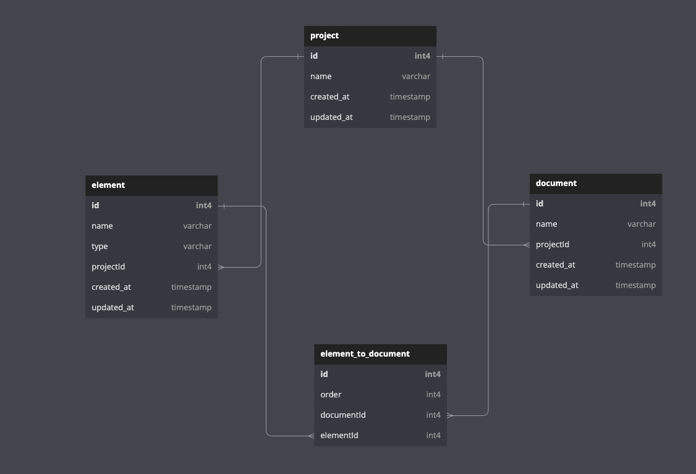

## Foleon Backend Challenge

### Description

The main goal of this application is to

> create a simple backend application for our front-end. The backend will be responsible for creating CRUD endpoints that allow us to create reusable elements and documents. Project can have multiple documents. Document is made of multiple elements (can have multiple elements of same type as well). Order of the elements in the document is important. One element can be used on multiple documents. Supported elements can be type of: button, image or text. Each entity (element/document/project) should have basic attributes like createdAt, name etc. When we are fetching document, combine all their elements (including their attributes) in proper order.

For the building of this application I used the following technologies:

- [Node.js](https://nodejs.org/en/) with [TypeScript](https://www.typescriptlang.org/)
- [NestJS](https://nestjs.com/) as the main framework
- [PostgreSQL](https://www.postgresql.org/) as database

### Database Schema



- `Project` table contains information about the project. It has a one-to-many relationship with the Document table. Also has a one-to-many relationship with the Element table that helps us to keep track of the elements that are used in multiple projects.
- `Document` table contains the information about the document. It has a one-to-many relationship with the Element table. Also has a many-to-one relationship with the Project table.
- `Element` table contains the information about the element. It has a many-to-one relationship with the Document table. Also has a many-to-one relationship with the Project table.
- And finally, the `element_to_document` table contains the information about the elements that are used in the document. It's the pivot table in relation (many-to-many) between the Elem

By using this schema we can easily create a document by using the elements that are used in other documents or projects. Also, we can keep tracking the order of the elements in the document by using the `order` column in the `element_to_document` table.

About the Apis and Test cases, I have tried to keep everything simple and straight.

> There is still a lot of work to do to make this application production ready. For example, we can add more tests, add more validations, add more error handling, add more logging, add more security, better api structure, add more documentation, add more features, etc. But I think this is enough for now.

## Getting Started

### Set up and run

To set up the API you need to open a terminal window and install the dependencies

```
npm install
```

You can find the server and database configuration in the `env` file. You have to change the database configuration and enter your credentials.

After that, you need to run migrations and seed the database.

```bash
npm run migration:run
npm run seed:run
```

Now you can start the API server:

```
npm run start
```

### Quick run with Docker

If you are tired of installing all the dependencies, you can run the application with Docker. You need to have Docker installed on your machine. After that, you can run the following command:

```bash
cp env-example .env
docker compose up -d
```

## Documenttion

Also you can find the swagger documentation in the following link: `http://localhost:3000/api`.

## Test

For running the tests you need to run the following command:
I have implemented the test cases just for `document` module which I believe is the most complicated module in this application.

```
npm run test
```
